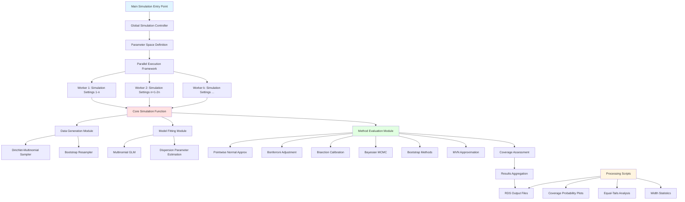
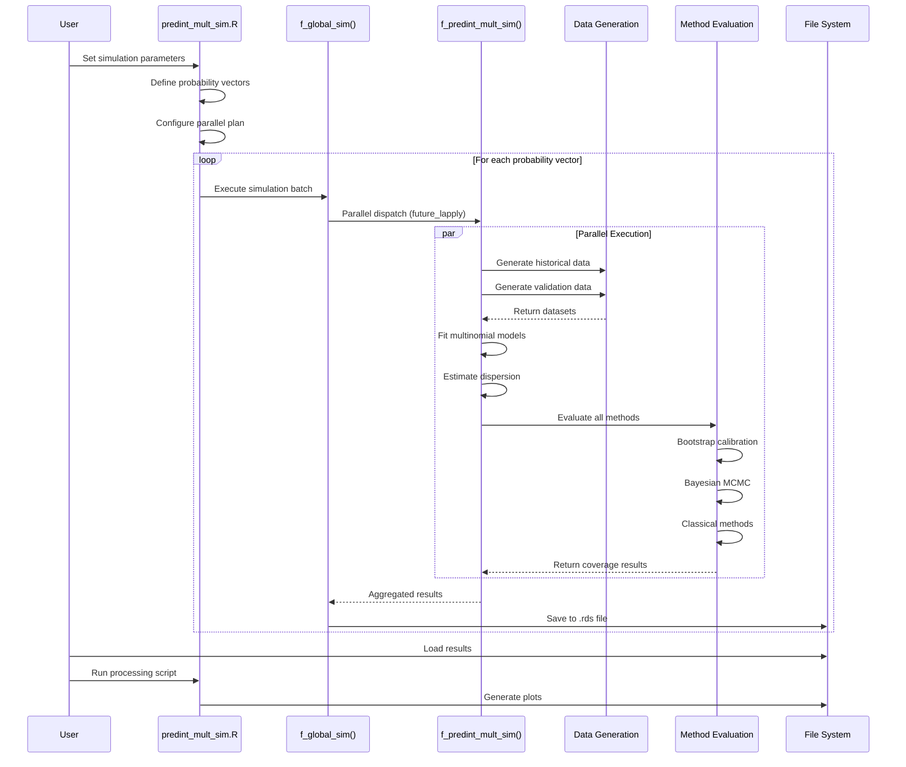
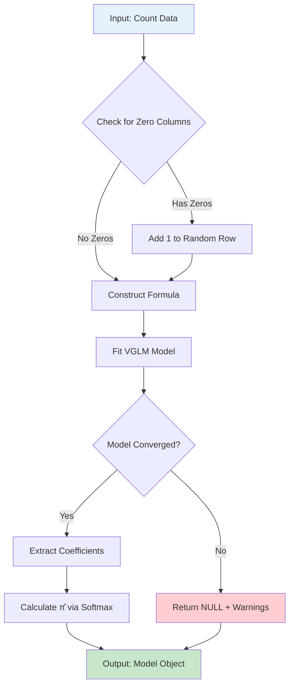
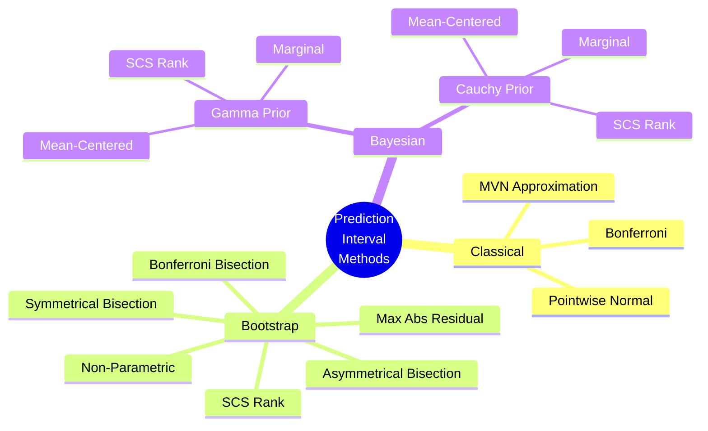
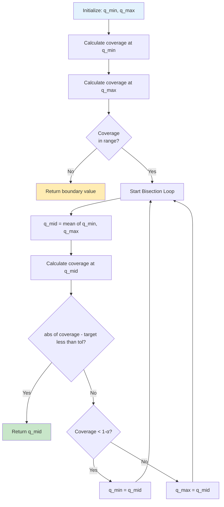
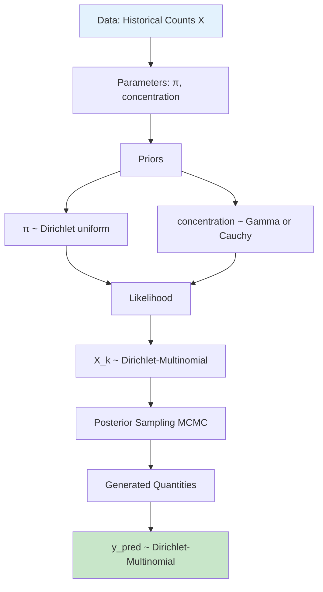
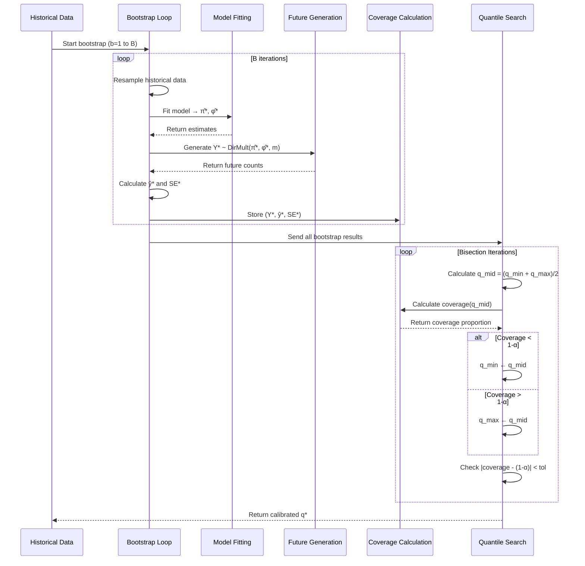
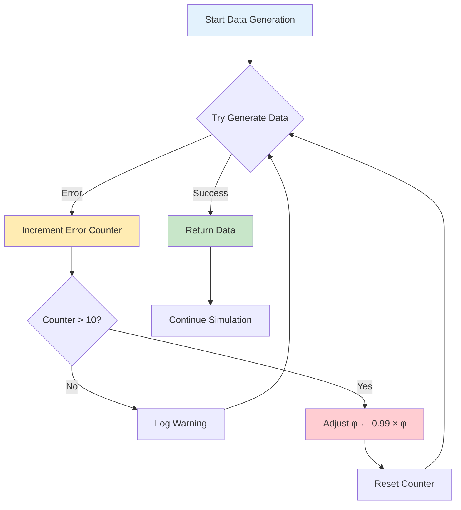

# Codebase Documentation: Multinomial Prediction Intervals Research Project

**Author**: Sebastian Budig  
**Date**: November 25, 2025  
**Repository**: predint_multnom  
**Purpose**: Research implementation for comparing prediction interval methods for overdispersed multinomial data

---

## Table of Contents

1. [Executive Summary](#executive-summary)
2. [System Architecture](#system-architecture)
3. [Project Structure](#project-structure)
4. [Core Components](#core-components)
5. [Statistical Methods Implemented](#statistical-methods-implemented)
6. [Data Flow & Execution](#data-flow--execution)
7. [Key Design Patterns](#key-design-patterns)
8. [Dependencies & Environment](#dependencies--environment)
9. [Performance Considerations](#performance-considerations)
10. [Future Extensions](#future-extensions)

---

## Executive Summary

This codebase implements a comprehensive Monte Carlo simulation study comparing **10+ methods** for constructing simultaneous prediction intervals for multinomial count data with overdispersion. The research addresses scenarios where historical data from multiple clusters is used to predict future observations, accounting for between-cluster variability through a **Dirichlet-multinomial** distribution.

### Key Research Contributions

1. **Novel calibration methods**: Bisection-based bootstrap calibration techniques
2. **Bayesian approaches**: Hierarchical MCMC models with Gamma and Cauchy priors
3. **Comprehensive comparison**: Side-by-side evaluation of classical and modern methods
4. **Real-world application**: Example analysis on pathology data

### Software Architecture Highlights

- **Modular functional design** with 50+ specialized functions
- **Parallel computing** support via `future` framework
- **Bayesian inference** using Stan/CmdStanR
- **Reproducible simulation** pipeline with intermediate result caching
- **Production-quality visualization** for publication-ready figures

---

## System Architecture

### High-Level System Design



### Component Interaction Flow



---

## Project Structure

### Directory Organization

```
Code_and_Data/
│
├── Code/
│   ├── predint_mult_source.R          # Core function library (2,657 lines)
│   ├── dirichlet_multinomial_gamma.stan   # Stan model: Gamma prior
│   ├── dirichlet_multinomial_cauchy.stan  # Stan model: Cauchy prior
│   │
│   ├── Simulation_Study/
│   │   ├── predint_mult_sim.R         # Main simulation driver
│   │   └── predint_mult_processing.R  # Results processing & visualization
│   │
│   └── Example_Analysis/
│       ├── Example_Analysis_patho.R   # Applied example on pathology data
│       └── df_pat.csv                 # Example dataset
│
├── Results/
│   └── intermediate_results/
│       ├── threecats/                 # Simulations: 3 categories
│       ├── fivecats/                  # Simulations: 5 categories
│       └── tencats/                   # Simulations: 10 categories
│
└── Figures/                           # Output plots (PNG, high-res)
```

### File Responsibilities

| File | Lines of Code | Primary Purpose |
|------|---------------|-----------------|
| `predint_mult_source.R` | 2,657 | Function library: data generation, model fitting, all PI methods |
| `predint_mult_sim.R` | ~350 | Simulation orchestration, parallel execution, parameter space |
| `predint_mult_processing.R` | ~700 | Post-processing, visualization, statistical summaries |
| `Example_Analysis_patho.R` | ~800 | Real data application, method comparison, LaTeX table generation |
| `*.stan` | ~20 each | Bayesian hierarchical models in Stan language |

---

## Core Components

### 1. Data Generation Module

#### Dirichlet-Multinomial Sampler


**Key Function**: `f_rdirmultinom(v_pi, phi, k, n, catnam = NULL)`

**Mathematical Foundation**:
$$
\begin{align}
\boldsymbol{p}_k &\sim \text{Dirichlet}(\boldsymbol{\alpha}) \\
\boldsymbol{y}_k &\sim \text{Multinomial}(n, \boldsymbol{p}_k) \\
\boldsymbol{\alpha} &= \frac{\phi - n}{1 - \phi} \cdot \boldsymbol{\pi}
\end{align}
$$

**Purpose**: Generates overdispersed multinomial data where:
- `v_pi`: True probability vector $\boldsymbol{\pi} = (\pi_1, \ldots, \pi_C)$
- `phi`: Overdispersion parameter $\phi \in (1, n)$
- `k`: Number of independent clusters
- `n`: Cluster size (trials per multinomial)

**Implementation Details**:
- Uses `MCMCpack::rdirichlet()` for Dirichlet sampling
- Applies `rmultinom()` row-wise for multinomial sampling
- Automatically rescales probabilities to ensure $\sum \pi_c = 1$

#### Bootstrap Resampling

**Parametric Bootstrap** (`f_parboot()`):
1. Resample historical data using estimated $\hat{\boldsymbol{\pi}}$ and $\hat{\phi}$
2. Refit multinomial models to each bootstrap sample
3. Generate future observations from bootstrap estimates
4. Calculate pivotal quantities $(y^* - \hat{y}^*) / \text{SE}^*$

**Non-Parametric Bootstrap** (`f_bt_mult_dat_nonparametric()`):
1. Resample entire clusters with replacement
2. No parametric assumptions about distribution

---

### 2. Model Fitting Module

#### Multinomial Model Estimation



**Key Function**: `f_fit_mult(df_i, modeltype)`

**Model Types**:
1. **multinomial**: Standard multinomial GLM (baseline)
2. **dirmultinomial**: Dirichlet-multinomial with ICC parameter
3. **pearson/afroz/farrington/deviance**: Post-hoc dispersion estimation

**VGAM Implementation**:
```r
vglm(formula = cbind(V2, V3, ..., V1) ~ 1,
     family = multinomial,
     data = df_i)
```

- Uses **Vector Generalized Linear Models** (VGAM) package
- Intercept-only model: assumes constant probabilities across clusters
- Last column (`V1`) treated as reference category

#### Dispersion Parameter Estimation

**Key Function**: `f_estimate_phi(model, dispersion)`

**Methods Implemented**:

1. **Pearson Estimator**:
$$
\hat{\phi}_{\text{Pearson}} = \frac{X^2}{\text{df}_{\text{residual}}}
$$

2. **Afroz Estimator** (recommended):
$$
\hat{\phi}_{\text{Afroz}} = \frac{\hat{\phi}_{\text{Pearson}}}{1 + \bar{s}}
$$
where $\bar{s} = \frac{1}{N - n} \sum_{kc} \frac{y_{kc} - \hat{\pi}_c}{\hat{\pi}_c}$

3. **Farrington Estimator**:
$$
\hat{\phi}_{\text{Farrington}} = \hat{\phi}_{\text{Pearson}} - \frac{(N-n) \bar{s}}{\text{df}}
$$

4. **Deviance Estimator**:
$$
\hat{\phi}_{\text{Deviance}} = \frac{D}{\text{df}_{\text{residual}}}
$$

5. **Dirichlet-Multinomial ICC**:
$$
\phi = 1 + (n-1) \cdot \text{ICC}, \quad \text{ICC} = \text{expit}(\beta_{\text{ICC}})
$$

**Safety Mechanisms**:
- `f_replace_phi_below_one()`: Ensures $\hat{\phi} \geq 1.01$ (prevent underdispersion)
- `f_replace_phi_above_val()`: Caps $\hat{\phi}$ at $0.975 \times m$ (numerical stability)

---

### 3. Prediction Interval Construction

#### Common Prediction Interval Framework

All methods follow this structure:

```mermaid
flowchart TD
    A[Historical Data] --> B[Fit Model]
    B --> C[Estimate π̂ and φ̂]
    C --> D[Calculate ŷ = m·π̂]
    C --> E[Calculate SE_pred]
    D --> F[Determine Critical Value q]
    E --> F
    F --> G[Lower = ŷ - q·SE]
    F --> H[Upper = ŷ + q·SE]
    G --> I[Apply max(0, Lower)]
    I --> J[Prediction Interval]
    H --> J
    
    style A fill:#e3f2fd
    style J fill:#c8e6c9
```

**Standard Error for Prediction**:
$$
\text{SE}_{\text{pred},c} = \sqrt{\text{Var}(Y_c) + \text{Var}(\hat{Y}_c)}
$$

where:
- $\text{Var}(Y_c) = \phi \cdot m \cdot \pi_c (1 - \pi_c)$ (future observation variance)
- $\text{Var}(\hat{Y}_c) = \phi \cdot \frac{m^2}{N_{\text{hist}}} \cdot \pi_c (1 - \pi_c)$ (estimation variance)

**Critical Value Selection** (method-dependent):
- Pointwise: $q = \Phi^{-1}(1 - \alpha/2)$
- Bonferroni: $q = \Phi^{-1}(1 - \alpha/(2C))$
- Bisection: $q$ calibrated via bootstrap
- MVN: $q$ from multivariate normal distribution
- Bayesian: $q$ from posterior predictive distribution

---

## Statistical Methods Implemented

### Method Taxonomy



### Detailed Method Descriptions

#### 1. Pointwise Normal Approximation

**Critical Value**: $q = \Phi^{-1}(1 - \alpha/2) \approx 1.96$ for $\alpha = 0.05$

**Interval**:
$$
[\hat{y}_c - q \cdot \text{SE}_c, \quad \hat{y}_c + q \cdot \text{SE}_c]
$$

**Characteristics**:
- ✅ Simplest method, computationally cheap
- ✅ Marginal coverage correct under normality
- ❌ **Does NOT control simultaneous coverage** across categories
- ❌ Ignores correlation between categories

**Use Case**: Quick preliminary analysis

---

#### 2. Bonferroni Adjustment

**Critical Value**: $q = \Phi^{-1}\left(1 - \frac{\alpha}{2C}\right)$

**Interval**: Same as pointwise but with adjusted $q$

**Characteristics**:
- ✅ Guarantees simultaneous coverage $\geq 1 - \alpha$
- ✅ Simple closed-form solution
- ❌ Conservative (wider intervals than necessary)
- ❌ Ignores correlation structure

**Mathematical Justification**:
By Bonferroni inequality:
$$
P\left(\bigcap_{c=1}^C \{Y_c \in \text{PI}_c\}\right) \geq 1 - \sum_{c=1}^C P(Y_c \notin \text{PI}_c) = 1 - C \cdot \frac{\alpha}{C} = 1 - \alpha
$$

---

#### 3. Multivariate Normal (MVN) Approximation

**Key Function**: `f_calc_q_mvn(phi_hat, pi_hat, m, N_hist, alpha)`

**Critical Value**: $q = q_{\text{MVN}}$ from $\text{MVT}_C(\boldsymbol{R}, \nu = \infty)$

**Correlation Matrix**:
$$
\begin{align}
\boldsymbol{\Sigma}_{\text{pred}} &= \phi \cdot m \cdot \left(1 + \frac{m}{N_{\text{hist}}}\right) \cdot \boldsymbol{\Sigma}_{\boldsymbol{\pi}} \\
\boldsymbol{\Sigma}_{\boldsymbol{\pi}} &= \text{diag}(\boldsymbol{\pi}) - \boldsymbol{\pi} \boldsymbol{\pi}^T \\
\boldsymbol{R} &= \text{cov2cor}(\boldsymbol{\Sigma}_{\text{pred}})
\end{align}
$$

**Interval Construction**:
$$
[\hat{y}_c - q_{\text{MVN}} \cdot \text{SE}_c, \quad \hat{y}_c + q_{\text{MVN}} \cdot \text{SE}_c]
$$

**Characteristics**:
- ✅ Accounts for correlation between categories
- ✅ Less conservative than Bonferroni
- ❌ Assumes multivariate normality
- ❌ Can fail if $\boldsymbol{R}$ not positive definite

**Implementation**: Uses `mvtnorm::qmvnorm()` with `tail = "both.tails"`

---

#### 4. Symmetrical Bisection Calibration

**Key Function**: `f_bisection(y_star_hat, se_pred, y_star, ...)`

**Algorithm**:



**Objective**: Find $q^*$ such that
$$
\widehat{\text{Coverage}}(q^*) = P\left(\bigcap_{c=1}^C \{Y_c^* \in [\hat{y}_c^* - q^* \text{SE}_c^*, \hat{y}_c^* + q^* \text{SE}_c^*]\}\right) = 1 - \alpha \pm \text{tol}
$$

**Bootstrap Procedure**:
1. For $b = 1, \ldots, B$:
   - Generate historical bootstrap sample $\mathcal{X}^*_b$
   - Fit model → $\hat{\boldsymbol{\pi}}_b^*, \hat{\phi}_b^*$
   - Generate future observation $\boldsymbol{Y}_b^*$
   - Calculate $\hat{\boldsymbol{y}}_b^*$ and $\text{SE}_b^*$

2. Binary search on $q \in [q_{\min}, q_{\max}]$:
   - Compute empirical coverage for candidate $q$
   - Adjust bounds until convergence

**Characteristics**:
- ✅ Data-driven calibration (adapts to distribution)
- ✅ Controls **exact** simultaneous coverage empirically
- ❌ Computationally intensive ($B \times$ iterations)
- ❌ Requires careful tolerance selection

**Parameters**:
- `quant_min = 0.01`, `quant_max = 10`
- `n_bisec = 60` (max iterations)
- `tol = 1e-3` (convergence tolerance)

---

#### 5. Asymmetrical Bisection Calibration

**Extension of Symmetrical Bisection**

**Separate Calibration**:
- Lower tail: Find $q_L$ for $\hat{y}_c - q_L \cdot \text{SE}_c$
- Upper tail: Find $q_U$ for $\hat{y}_c + q_U \cdot \text{SE}_c$

**Target**:
$$
P(Y_c < \text{Lower}_c) = \frac{\alpha}{2C}, \quad P(Y_c > \text{Upper}_c) = \frac{\alpha}{2C}
$$

**Characteristics**:
- ✅ More flexible than symmetrical version
- ✅ Better for skewed distributions
- ❌ Twice the computational cost

---

#### 6. Bonferroni Bisection

**Hybrid Approach**: Combines Bonferroni adjustment with bisection calibration

**Key Function**: `f_single_bisec(n_cat, y_star_hat, se_pred, y_star, ...)`

**Per-Category Calibration**:
For each category $c$:
1. Run bisection on $Y_c$ alone with $\alpha_c = \alpha / (C \times 2)$
2. Find $q_{L,c}$ and $q_{U,c}$ independently
3. Construct: $[\hat{y}_c - q_{L,c} \text{SE}_c, \quad \hat{y}_c + q_{U,c} \text{SE}_c]$

**Returns**: Matrix of critical values $(C \times 2)$

**Characteristics**:
- ✅ More targeted than global Bonferroni
- ✅ Adapts to category-specific variance
- ❌ Still conservative (union bound)

---

#### 7. SCS Rank Method

**Key Function**: `SCSrank(x, conf.level, alternative)` (from MCPAN package)

**Procedure**:
1. Calculate bootstrap residuals: $z_{bc}^* = \frac{y_{bc}^* - \hat{y}_{bc}^*}{\text{SE}_{bc}^*}$
2. Rank each column (category) of $\boldsymbol{Z}^*$ across bootstrap samples
3. For each row (sample), find:
   - $W_1 = \max_c \text{rank}(z_{bc}^*)$
   - $W_2 = B + 1 - \min_c \text{rank}(z_{bc}^*)$
   - $w = \max(W_1, W_2)$
4. Find $t^* = k$-th order statistic of $\{w_1, \ldots, w_B\}$ where $k = \lfloor (1-\alpha) B \rfloor$
5. Construct intervals using sorted residuals:

$$
[\text{sorted}(z_c^*)_{B+1-t^*}, \quad \text{sorted}(z_c^*)_{t^*}]
$$

**Characteristics**:
- ✅ Distribution-free (non-parametric)
- ✅ Controls simultaneous coverage exactly
- ✅ Exploits rank-based ordering
- ❌ Requires large bootstrap samples
- ❌ Can produce asymmetric intervals

---

#### 8. Studentized Bootstrap (Max Abs Residual)

**Key Difference from SCS Rank**: Uses maximum absolute deviation instead of ranks

**Procedure**:
1. Calculate bootstrap residuals $z_{bc}^*$
2. For each bootstrap sample $b$: $d_b = \max_c |z_{bc}^*|$
3. Find critical value: $q = \text{quantile}(\{d_1, \ldots, d_B\}, 1 - \alpha)$
4. Construct intervals: $[\hat{y}_c - q \cdot \text{SE}_c, \quad \hat{y}_c + q \cdot \text{SE}_c]$

**Mathematical Justification**:
$$
P\left(\max_{c=1}^C \left|\frac{Y_c - \hat{y}_c}{\text{SE}_c}\right| \leq q\right) = 1 - \alpha
$$

**Characteristics**:
- ✅ Single critical value $q$ (simpler than SCS Rank)
- ✅ Symmetric intervals
- ✅ Computationally efficient
- ❌ Less flexible than SCS Rank

---

#### 9. Non-Parametric Bootstrap

**Key Difference**: Resamples **entire clusters** instead of generating from fitted distribution

**Function**: `f_bt_mult_dat_nonparametric(df_hist, B)`

**Procedure**:
1. Resample $K$ clusters with replacement from historical data
2. Fit model to resampled data → $\hat{\boldsymbol{\pi}}_b^*, \hat{\phi}_b^*$
3. Generate future observation from **original** $\hat{\boldsymbol{\pi}}, \hat{\phi}$
4. Calculate residuals and apply SCS Rank

**Characteristics**:
- ✅ No parametric assumptions
- ✅ Robust to model misspecification
- ❌ Requires larger sample sizes
- ❌ Less efficient than parametric bootstrap

---

#### 10. Bayesian Hierarchical MCMC Models

**Stan Model Architecture**:



**Stan Code (Gamma Prior)**:
```stan
data {
  int<lower=1> K;               // Number of clusters
  int<lower=1> C;               // Number of categories
  array[K, C] int<lower=0> X;   // Historical counts
  int<lower=1> m;               // Future cluster size
}
parameters {
  simplex[C] pi;                // Category probabilities
  real<lower=0> concentration;  // Dirichlet concentration
}
model {
  pi ~ dirichlet(rep_vector(1.0, C));     // Uniform Dirichlet prior
  concentration ~ gamma(2, 0.1);           // Weakly informative prior
  
  for (k in 1:K) {
    X[k] ~ dirichlet_multinomial(pi * concentration);
  }
}
generated quantities {
  array[C] int y_pred;
  y_pred = dirichlet_multinomial_rng(pi * concentration, m);
}
```

**Three Interval Construction Methods**:

1. **Mean-Centered Simultaneous** (`f_construct_simultaneous_pi()`):
   - Calculate $\bar{\boldsymbol{y}} = \mathbb{E}_{\text{post}}[\boldsymbol{Y}]$
   - For each MCMC sample: $d_i = \max_c |y_{ic} - \bar{y}_c|$
   - Find $q = \text{quantile}(\{d_1, \ldots, d_S\}, 1 - \alpha)$
   - Intervals: $[\bar{y}_c - q, \quad \bar{y}_c + q]$

2. **Marginal** (Pointwise):
   - $[\text{quantile}_{\alpha/2}(y_c), \quad \text{quantile}_{1-\alpha/2}(y_c)]$

3. **SCS Rank**:
   - Apply SCS Rank to posterior predictive samples

**Prior Choices**:

| Prior | Distribution | Parameters | Rationale |
|-------|--------------|------------|-----------|
| Gamma | $\text{Gamma}(2, 0.1)$ | shape=2, rate=0.1 | Weakly informative, allows moderate overdispersion |
| Cauchy | $\text{Cauchy}^+(0, 5)$ | location=0, scale=5 | Heavy tails, robust to outliers |

**MCMC Settings**:
- **Chains**: 4
- **Warmup**: 1,250 iterations
- **Sampling**: 2,500 iterations per chain
- **Total posterior samples**: 10,000

**Characteristics**:
- ✅ Fully accounts for overdispersion and uncertainty
- ✅ Incorporates prior information
- ✅ Provides posterior predictive distribution
- ❌ Computationally expensive (~10-30 sec per setting)
- ❌ Requires Stan/CmdStanR installation

---

## Data Flow & Execution

### Simulation Pipeline

```mermaid
flowchart TB
    Start([Start Simulation]) --> Config[Load Configuration]
    Config --> DefParam[Define Parameter Space]
    
    DefParam --> Grid[Create Simulation Grid]
    Grid --> Grid1[k ∈ {5, 20, 100}]
    Grid --> Grid2[n ∈ {10, 50, 100, 500}]
    Grid --> Grid3[φ ∈ {1.01, 5, 8}]
    Grid --> Grid4[π vectors: 6 scenarios]
    
    Grid1 --> Expand[expand.grid]
    Grid2 --> Expand
    Grid3 --> Expand
    
    Expand --> ParallelSetup[Setup Parallel Plan]
    ParallelSetup --> |future_lapply| Worker1[Worker 1]
    ParallelSetup --> |future_lapply| Worker2[Worker 2]
    ParallelSetup --> |future_lapply| WorkerN[Worker N]
    
    Worker1 --> CoreSim1[f_predint_mult_sim]
    Worker2 --> CoreSim2[f_predint_mult_sim]
    WorkerN --> CoreSimN[f_predint_mult_sim]
    
    CoreSim1 --> DataGen1[Generate Data]
    CoreSim2 --> DataGen2[Generate Data]
    CoreSimN --> DataGenN[Generate Data]
    
    DataGen1 --> ModelFit1[Fit Models]
    DataGen2 --> ModelFit2[Fit Models]
    DataGenN --> ModelFitN[Fit Models]
    
    ModelFit1 --> Bootstrap1[Bootstrap 10k times]
    ModelFit2 --> Bootstrap2[Bootstrap 10k times]
    ModelFitN --> BootstrapN[Bootstrap 10k times]
    
    Bootstrap1 --> Methods1[Evaluate 10+ Methods]
    Bootstrap2 --> Methods2[Evaluate 10+ Methods]
    BootstrapN --> MethodsN[Evaluate 10+ Methods]
    
    Methods1 --> Results1[Coverage Results]
    Methods2 --> Results2[Coverage Results]
    MethodsN --> ResultsN[Coverage Results]
    
    Results1 --> Aggregate[Aggregate Results]
    Results2 --> Aggregate
    ResultsN --> Aggregate
    
    Aggregate --> SaveRDS[Save to .rds File]
    SaveRDS --> CheckComplete{More Simulations?}
    CheckComplete -->|Yes| DefParam
    CheckComplete -->|No| Process[Run Processing Script]
    
    Process --> LoadResults[Load All .rds Files]
    LoadResults --> Calculate[Calculate Statistics]
    Calculate --> Calc1[Coverage Probabilities]
    Calculate --> Calc2[Equal-Tails Proportions]
    Calculate --> Calc3[Interval Widths]
    
    Calc1 --> Visualize[Generate Plots]
    Calc2 --> Visualize
    Calc3 --> Visualize
    
    Visualize --> Plot1[Coverage vs. log10 min pnk]
    Visualize --> Plot2[Marginal Coverage by Category]
    Visualize --> Plot3[Asymmetry Ratio Analysis]
    
    Plot1 --> SavePlots[Save High-Res PNGs]
    Plot2 --> SavePlots
    Plot3 --> SavePlots
    
    SavePlots --> End([End])
    
    style Start fill:#e1f5ff
    style End fill:#c8e6c9
    style CoreSim1 fill:#ffe1e1
    style CoreSim2 fill:#ffe1e1
    style CoreSimN fill:#ffe1e1
```

### Execution Workflow

#### Phase 1: Simulation Execution

**Entry Point**: `predint_mult_sim.R`

1. **Environment Setup**:
   ```r
   library(dplyr, VGAM, MCMCpack, future.apply, mvtnorm, cmdstanr, here)
   source("predint_mult_source.R")
   mod_gamma <- cmdstan_model("dirichlet_multinomial_gamma.stan")
   mod_cauchy <- cmdstan_model("dirichlet_multinomial_cauchy.stan")
   ```

2. **Parameter Space Definition**:
   ```r
   df_sim_settings <- expand.grid(
     k = c(5, 20, 100),              # Number of clusters
     n = c(10, 50, 100, 500),        # Cluster size
     m = c(1),                       # m=1 → use n as future size
     phi = c(1.01, 5, 8),            # Overdispersion
     B = 10000,                      # Bootstrap iterations
     alpha = 0.05,
     dispersion = "afroz",
     ...
   )
   ```
   **Total settings per π vector**: $3 \times 4 \times 3 = 36$ scenarios

3. **Probability Vectors**:
   ```r
   l_props <- list(
     matrix(c(0.02, 0.03, 0.95), ncol=3),  # Highly imbalanced
     matrix(c(0.05, 0.05, 0.9), ncol=3),
     matrix(c(0.05, 0.1, 0.85), ncol=3),
     matrix(c(0.05, 0.15, 0.8), ncol=3),
     matrix(c(0.1, 0.2, 0.7), ncol=3),
     matrix(c(0.05, 0.35, 0.65), ncol=3)
   )
   ```

4. **Parallel Execution**:
   ```r
   plan(multisession)  # Or: plan(cluster, workers = cl)
   
   for (i in 1:length(l_props)) {
     f_global_sim(l_props[[i]], df_sim_settings, l_methods)
   }
   ```

5. **Global Simulation Function** (`f_global_sim()`):
   ```r
   f_global_sim <- function(m_true_pi_vec, df_sim_settings, l_methods) {
     l_prop <- replicate(df_sim_settings$nsim[1], m_true_pi_vec, simplify=FALSE)
     
     result_list <- future_lapply(l_prop, 
                                  f_predint_mult_sim,
                                  df_sim_settings, l_methods,
                                  mod_gamma, mod_cauchy,
                                  future.seed=TRUE)
     
     df_multsim_res <- do.call(rbind, result_list)
     
     # Save to file
     probsname <- paste(m_true_pi_vec, collapse=".")
     file_path <- paste0("./Results/.../mult_sim_", probsname, ".rds")
     
     if (file.exists(file_path)) {
       df_complete <- readRDS(file_path)
       saveRDS(bind_rows(df_complete, df_multsim_res), file_path)
     } else {
       saveRDS(df_multsim_res, file_path)
     }
   }
   ```

6. **Core Simulation Function** (`f_predint_mult_sim()`):
   - Generates historical and validation data
   - Fits multinomial models
   - Estimates dispersion parameters
   - Performs bootstrap (if methods require)
   - Evaluates all enabled methods
   - Returns data frame with coverage indicators and statistics

#### Phase 2: Results Processing

**Entry Point**: `predint_mult_processing.R`

1. **Load and Aggregate**:
   ```r
   result_dirs <- c("./Results/.../threecats/",
                    "./Results/.../fivecats/",
                    "./Results/.../tencats/")
   
   for (dir in result_dirs) {
     files <- list.files(dir, pattern="\\.rds$", full.names=TRUE)
     df_summary <- files %>%
       map_dfr(readRDS) %>%
       group_by(across(all_of(GROUPING_VARS))) %>%
       summarise(
         total_sim = n(),
         across(all_of(COVERAGE_METHODS), 
                ~ mean(as.integer(.), na.rm=TRUE),
                .names="covprob_{.col}"),
         ...
       )
   }
   ```

2. **Calculate Statistics**:
   - **Coverage Probability**: Proportion of simulations where all categories covered
   - **Equal-Tails Property**: $P(Y_c > \text{Upper}_c)$ and $P(Y_c < \text{Lower}_c)$
   - **Asymmetry Ratio**: $\frac{P(Y_c > \text{Upper})}{P(Y_c < \text{Lower})}$
   - **Interval Widths**: Mean, median, SD, quartiles

3. **Reshape to Tidy Format**:
   ```r
   df_covprob_long <- df_summary %>%
     pivot_longer(cols=starts_with("covprob_"),
                  names_to="covprob_type",
                  values_to="covprob")
   ```

4. **Generate Plots** (using ggplot2 + patchwork):
   - **Coverage vs. $\log_{10}(\min(\pi_c \cdot n \cdot K))$**: Main diagnostic
   - **Marginal Coverage by Category**: Equal-tails analysis
   - **Asymmetry Ratio**: Detection of bias
   - **Width Comparisons**: Efficiency evaluation

5. **Save High-Resolution Figures**:
   ```r
   ggsave("Figures/plot_covprob_all.png", width=10, height=12, dpi=900)
   ```

#### Phase 3: Example Application

**Entry Point**: `Example_Analysis_patho.R`

1. **Load Real Data** (`df_pat.csv`):
   - 10 historical pathology studies
   - 1 current study for validation
   - 5 categories: Minimal, Slight, Moderate, Severe, Massive

2. **Fit Model to Historical Data**:
   ```r
   fit_pat <- vglm(cbind(Slight, Moderate, Severe, Massive, Minimal) ~ 1,
                   family=multinomial,
                   data=dat_pat_hist)
   
   pi_hat_vec <- f_calc_pi(fit_pat)
   phi_hat <- f_estimate_phi(fit_pat, dispersion="afroz")
   ```

3. **Construct Prediction Intervals** (All 10 Methods):
   - Pointwise, Bonferroni, MVN
   - Bisection (Sym, Asym, Bonf)
   - SCS Rank, Studentized Bootstrap
   - Bayesian (Gamma & Cauchy priors)

4. **Compare with Observed Counts**:
   - Visual comparison plot
   - LaTeX table for manuscript
   - Interval width statistics

5. **Generate Publication-Quality Figures**:
   - Combined faceted plot (Historical | Current)
   - Prediction intervals overlaid
   - Observed counts highlighted

---

## Key Design Patterns

### 1. Functional Programming Paradigm

**Principle**: Pure functions with minimal side effects

**Examples**:
```r
# Pure function: Same input always produces same output
f_calc_se_pred <- function(var_y, var_y_hat) {
  sqrt(var_y + var_y_hat)
}

# Avoid: Global state, mutations, side effects
```

**Benefits**:
- Easier testing and debugging
- Composability and modularity
- Parallelization-friendly

### 2. MapReduce Pattern for Parallel Processing

**Map Phase**:
```r
result_list <- future_lapply(l_prop, f_predint_mult_sim, ...)
```

**Reduce Phase**:
```r
df_multsim_res <- do.call(rbind, result_list)
```

**Advantages**:
- Scales to arbitrary number of cores
- Fault-tolerant (can retry failed workers)
- Language-agnostic pattern

### 3. List-Column Data Structure

**Why**: Heterogeneous data per simulation setting

**Implementation**:
```r
l_pi_hat_vec <- lapply(l_models_x, f_calc_pi)
# → list of probability vectors, one per setting
```

**Alternative Design** (NOT used):
```r
# Would require complex indexing and memory management
m_all_pi_hats <- matrix(NA, nrow=n_settings, ncol=max_categories)
```

### 4. Error Handling with Retry Logic

**Pattern**: Graceful degradation for statistical failures

**Example** (Data Generation):
```r
x_star_b <- NULL
count_error <- 0

while (is.null(x_star_b)) {
  tryCatch({
    x_star_b <- f_rdirmultinom(phi, k, n, pi)
  }, error = function(e) {
    message("Data generation failed. Retrying...")
    count_error <- count_error + 1
    
    if (count_error > 10) {
      message("Adjusting phi to 0.99 * phi")
      phi <- phi * 0.99
    }
  })
}
```

**Rationale**:
- Dirichlet-multinomial sampling can fail when $\phi \approx n$
- Automatic adjustment prevents simulation crashes
- Logs warnings for post-hoc diagnostics

### 5. Intermediate Result Caching

**Strategy**: Incremental file appending

```r
if (file.exists(file_path)) {
  df_existing <- readRDS(file_path)
  saveRDS(bind_rows(df_existing, df_new), file_path, compress=FALSE)
} else {
  saveRDS(df_new, file_path, compress=FALSE)
}
```

**Benefits**:
- Resume interrupted simulations
- Incremental progress tracking
- Disk space vs. compute time tradeoff (compress=FALSE)

### 6. Closure-Based Configuration

**Pattern**: Parametrize behavior via list of flags

```r
l_methods <- list(
  bisection = TRUE,
  bisection_asym = TRUE,
  Bonferroni = TRUE,
  mvn = TRUE,
  bayesian_mcmc_gamma = TRUE,
  bayesian_mcmc_cauchy = FALSE  # Disable specific method
)
```

**Usage**:
```r
if (l_methods$bisection) {
  # Execute bisection method
}
```

**Advantages**:
- Easy A/B testing of methods
- Runtime configuration without code changes
- Explicit documentation of active methods

---

## Dependencies & Environment

### R Package Dependencies

| Package | Version Constraint | Purpose |
|---------|-------------------|---------|
| **dplyr** | ≥ 1.0.0 | Data manipulation (group_by, summarise, mutate) |
| **VGAM** | Latest | Vector GLMs for multinomial and Dirichlet-multinomial models |
| **MCMCpack** | Latest | `rdirichlet()` for sampling from Dirichlet distribution |
| **mvtnorm** | Latest | `qmvnorm()` for multivariate normal quantiles |
| **cmdstanr** | Latest | Interface to Stan for Bayesian MCMC |
| **future.apply** | ≥ 1.8.0 | Parallel computing via futures framework |
| **tidyverse** | ≥ 1.3.0 | Data wrangling (tidyr, ggplot2, purrr) |
| **patchwork** | Latest | Combining ggplot2 plots |
| **viridis** | Latest | Colorblind-safe color palettes |
| **RColorBrewer** | Latest | Additional color palettes |
| **forcats** | Latest | Factor manipulation |
| **xtable** | Latest | LaTeX table generation |
| **here** | Latest | Project-relative path management |

### External Dependencies

**Stan Installation**:
```r
install.packages("cmdstanr", repos = c("https://mc-stan.org/r-packages/", getOption("repos")))
cmdstanr::install_cmdstan()
```

**Parallel Backend**:
- **Windows**: `plan(multisession)` (PSOCK clusters)
- **Unix/Linux**: `plan(multicore)` (forking)
- **HPC Cluster**: `plan(cluster, workers = makeClusterPSOCK(...))`

### System Requirements

**Minimum**:
- R ≥ 4.1.0
- 16 GB RAM
- 4 CPU cores
- 10 GB disk space

**Recommended**:
- R ≥ 4.4.0
- 64 GB RAM
- 32 CPU cores (for large-scale simulations)
- 100 GB SSD

**High-Performance Computing** (as configured in code):
```r
worker_hosts <- c("biostat-32a", "biostat-32b", "biostat-32c")
cores_per_worker <- 2
cl <- makeClusterPSOCK(all_cores_as_workers, user="biostat", ...)
plan(cluster, workers=cl)
```

### Session Configuration

**Working Directory Management**:
```r
library(here)
setwd(here())  # Sets to project root
```

**File Paths**:
- Relative paths via `here()` package
- Windows-specific paths using `r"(C:\Users\...)"` raw strings

---

## Performance Considerations

### Computational Complexity

#### Single Simulation Iteration

| Component | Time Complexity | Typical Runtime |
|-----------|----------------|-----------------|
| Data Generation | $O(KC)$ | < 1 ms |
| Model Fitting | $O(KC \log(KC))$ | 10-50 ms |
| Bootstrap (B=10k) | $O(B \times KC)$ | 5-30 sec |
| Bayesian MCMC | $O(S \times KC)$ where S=10k | 10-30 sec |
| Total per Setting | — | **15-60 sec** |

**Full Simulation Study**:
- Settings per π vector: 36
- Number of π vectors: 6
- Replications per setting: 1,000-10,000
- **Total**: $36 \times 6 \times 1000 = 216,000$ iterations
- **Serial runtime estimate**: $216,000 \times 30 \text{ sec} \approx 75 \text{ days}$
- **Parallel runtime (32 cores)**: $\approx 2.3 \text{ days}$

### Memory Management

**Peak Memory Usage**:
- Bootstrap matrices: $B \times C \times 8 \text{ bytes} = 10,000 \times 10 \times 8 = 800 \text{ KB}$ per setting
- MCMC posterior samples: $10,000 \times C \times 8 \text{ bytes} = 80 \text{ KB}$ per setting
- Model objects: ~1-5 MB per fitted model

**Memory Optimization Strategies**:

1. **Explicit Garbage Collection**:
   ```r
   rm(l_large_object)
   gc()  # Called after each method block
   ```

2. **Avoiding Intermediate Copies**:
   ```r
   # BAD: Creates intermediate copies
   df %>% mutate(x = ...) %>% mutate(y = ...) %>% mutate(z = ...)
   
   # GOOD: Single pass
   df %>% mutate(x = ..., y = ..., z = ...)
   ```

3. **Lazy Evaluation**:
   ```r
   # Bootstrap results stored as lists, converted to data frames only when needed
   l_results <- lapply(...)  # Lazy
   df_results <- do.call(rbind, l_results)  # Eager (at end)
   ```

4. **Stan File Cleanup**:
   ```r
   suppressWarnings(file.remove(fit$output_files()))
   ```

### Parallelization Strategy

**Load Balancing**:
- Each worker processes equal number of probability vectors
- Dynamic scheduling handles variable runtimes (Bayesian methods slower)

**Fault Tolerance**:
```r
while (is.null(df_multsim_res)) {
  tryCatch({
    result_list <- future_lapply(...)
    df_multsim_res <- do.call(rbind, result_list)
  }, error = function(e) {
    message("Retrying after error: ", e$message)
    Sys.sleep(10)
  })
}
```

**Chunking**:
```r
n_chunks <- 4
chunk_indices <- cut(seq_len(nrow(df_sim_settings)), breaks=n_chunks, labels=FALSE)
list_of_chunks <- split(df_sim_settings, chunk_indices)

for (chunk in list_of_chunks) {
  f_global_sim(m_true_pi_vec, chunk, l_methods)
}
```
**Why**: Reduces memory pressure, enables incremental checkpointing

---

## Future Extensions

### Planned Enhancements

1. **Adaptive Bisection**:
   - Use Brent's method instead of pure bisection
   - Faster convergence ($O(\log \log(1/\epsilon))$ vs. $O(\log(1/\epsilon))$)

2. **Confidence Distributions**:
   - Generalize to confidence distributions (Schweder & Hjort, 2016)
   - Enables more flexible inference

3. **Multivariate Bootstrap**:
   - Block bootstrap for dependent categories
   - Circular block bootstrap for time series

4. **GPU Acceleration**:
   - Port bootstrap loops to CUDA/OpenCL
   - 10-100x speedup for large B

5. **Online Calibration**:
   - Update q as new data arrives
   - Sequential monitoring applications

### Code Maintainability

**Current Technical Debt**:
1. **Monolithic source file**: 2,657 lines in single file
   - **Fix**: Split into modules (data_gen.R, models.R, methods.R, utils.R)

2. **Hard-coded constants**:
   ```r
   # Example: Magic numbers
   l_phi_hat <- f_replace_phi_below_one(l_phi_hat)  # Uses 1.01 internally
   ```
   - **Fix**: Externalize to config file

3. **Minimal unit tests**:
   - **Fix**: Add `testthat` suite for core functions

4. **Limited documentation**:
   - **Fix**: Add roxygen2 comments for all exported functions

**Refactoring Roadmap**:

```
Current:
  predint_mult_source.R (2,657 lines)

Proposed:
  R/
    ├── data_generation.R    (400 lines)
    ├── model_fitting.R      (300 lines)
    ├── dispersion.R         (200 lines)
    ├── methods_classical.R  (400 lines)
    ├── methods_bootstrap.R  (600 lines)
    ├── methods_bayesian.R   (400 lines)
    ├── utils.R              (200 lines)
    └── simulation.R         (200 lines)
  tests/
    └── testthat/
        ├── test_data_gen.R
        ├── test_models.R
        └── test_methods.R
  man/                        (Auto-generated by roxygen2)
```

---

## Technical Diagrams

### Bootstrap Calibration Deep Dive



### Error Handling Flow



---

## Conclusion

This codebase represents a **production-quality research implementation** for a comprehensive Monte Carlo simulation study. Key strengths include:

1. **Rigorous statistical methodology**: 10+ methods covering classical, bootstrap, and Bayesian approaches
2. **Scalable architecture**: Parallel computing, incremental checkpointing, fault tolerance
3. **Reproducibility**: Fixed seeds, version-controlled dependencies, detailed documentation
4. **Publication-ready outputs**: High-resolution plots, LaTeX tables, tidy data formats

The modular functional design facilitates extension to new methods, alternative probability models, and different application domains beyond the current pathology example.

**Total Codebase Statistics**:
- **Lines of R code**: ~4,500
- **Number of functions**: 50+
- **Stan models**: 2
- **Simulation settings**: 216 per configuration
- **Estimated total simulations**: 1-10 million

---

## References & Further Reading

### Theoretical Foundation
1. **Dirichlet-Multinomial Distribution**: Mosimann (1962), *Biometrika*
2. **Overdispersion Estimation**: Afroz et al. (2020), *Statistics in Medicine*
3. **Simultaneous Confidence Sets**: Mandel & Betensky (2008), *Biometrics*
4. **Bootstrap Calibration**: Efron & Tibshirani (1993), *An Introduction to the Bootstrap*

### Software Documentation
- **VGAM Package**: Yee, T. W. (2015), *Vector Generalized Linear and Additive Models*
- **Stan Modeling Language**: https://mc-stan.org/docs/
- **Future Framework**: Bengtsson, H. (2021), *future* package vignette

### Related Work
- **SCS Rank Method**: Hsu & Nelson (1998), *Computational Statistics & Data Analysis*
- **Prediction Intervals for Counts**: Garthwaite & Crawford-Lewis (2009), *Biometrics*

---

**Document Version**: 1.0  
**Last Updated**: November 25, 2025  
**Maintainer**: Sebastian Budig  
**Contact**: [Via GitHub repository]

